# Class Diagram - Astrology Backend

> Complete architecture showing controllers, services, models, interfaces, and relationships

```mermaid
%%{init: {"theme": "dark"}}%%
classDiagram
    direction TB
    
    %% ===== BASE CLASSES =====
    class BaseController {
        <<abstract>>
        +ok() Response
        +created() Response
        +fail() Response
        +asyncHandler() Handler
    }
    
    class BaseService {
        <<abstract>>
        #serviceName: string
        +logInfo() void
        +logError() void
    }
    
    %% ===== INTERFACES =====
    class IAstroService {
        <<interface>>
        +fetchManglikDosh() Promise
        +fetchOtherdosha() Promise
        +fetchBirthChart() Promise
    }
    
    class ICacheService {
        <<interface>>
        +get() Promise
        +set() Promise
        +delete() Promise
    }
    
    %% ===== USER MODEL (Encapsulation) =====
    class IUser {
        <<public>>
        +_id: ObjectId
        +name: string
        +email: string
        +role: string
        +createdAt: Date
        +updatedAt: Date
    }
    
    class IUserInternal {
        <<private>>
        +password: string
        +resetPasswordToken: string
        +resetPasswordExpires: Date
    }
    
    class UserModel {
        +toJSON() object
    }
    
    %% ===== DOSHA MODEL (Encapsulation) =====
    class IDoshaReport {
        <<public>>
        +_id: ObjectId
        +doshaType: string
        +isPresent: boolean
        +severity: string
        +summary: string
        +remedies: string[]
    }
    
    class IDoshaReportInternal {
        <<private>>
        +inputParams: object
        +apiResponse: object
    }
    
    class DoshaReportModel {
        +toJSON() object
    }
    
    %% ===== CONTROLLERS =====
    class AstroController {
        +register()
        +login()
        +forgotPassword()
        +resetPassword()
        +deletedAccount()
    }
    
    class ProfileController {
        +createProfile()
        +getProfile()
        +updateProfile()
        +deleteProfile()
    }
    
    class ChartController {
        +generateChart()
        +getChart()
        +getChartById()
        +renameChart()
        +deleteChart()
    }
    
    class DoshaController {
        +getDoshaTypes()
        +searchDoshas()
        +checkDosha()
        +getDoshaReport()
        +deleteDoshaReport()
    }
    
    %% ===== SERVICES =====
    class AstroService {
        -DOSHA_ENDPOINT_MAP
        -client: AxiosInstance
        +callApi() Promise
        +fetchManglikDosh() Promise
        +fetchOtherdosha() Promise
        +fetchBirthChart() Promise
    }
    
    class DoshaService {
        +formatDate() string
        +calculateSeverity() string
        +formatReport() object
    }
    
    class BirthChartService {
        +formatDate() string
        +isValidTimeFormat() boolean
        +convertTo24Hour() string
    }
    
    class ProfileService {
        +getProfileByUserId() Promise
        +createProfile() Promise
        +updateProfile() Promise
        +deleteProfile() Promise
    }
    
    %% ===== RELATIONSHIPS =====
    BaseController <|-- AstroController
    BaseController <|-- ProfileController
    BaseController <|-- ChartController
    BaseController <|-- DoshaController
    
    BaseService <|-- AstroService
    BaseService <|-- DoshaService
    BaseService <|-- BirthChartService
    BaseService <|-- ProfileService
    
    IAstroService <|.. AstroService
    ICacheService <|.. CacheService
    
    IUser <|-- IUserInternal
    IUser <|.. UserModel
    
    IDoshaReport <|-- IDoshaReportInternal
    IDoshaReport <|.. DoshaReportModel
    
    note for BaseController "Abstraction"
    note for BaseService "Abstraction"
    note for IAstroService "Dependency Inversion"
    note for DOSHA_ENDPOINT_MAP "Open/Closed Principle"
```

---

## SOLID Principles

| Principle | Implementation |
|-----------|----------------|
| Single Responsibility | Each service has focused methods |
| Open/Closed | DOSHA_ENDPOINT_MAP - add new doshas without changing code |
| Liskov Substitution | All controllers extend BaseController |
| Interface Segregation | IAstroService, ICacheService interfaces |
| Dependency Inversion | Depend on interfaces, not concrete classes |

---

## OOP Encapsulation

| Model | Public | Private |
|-------|--------|---------|
| User | IUser (name, email, role) | IUserInternal (password, tokens) |
| DoshaReport | IDoshaReport (doshaType, severity, summary) | IDoshaReportInternal (birth data, apiResponse) |

Both use toJSON() to filter sensitive data from API responses.

---

*Updated: April 2026*
