# Class Diagram

> Architecture overview for the Astrology backend - showing controllers, services, models, interfaces, and their relationships.
> Updated with SOLID principles implementation and OOP encapsulation.

```mermaid
%%{init: {'theme': 'base', 'themeVariables': { 'primaryColor': '#4a90d9', 'edgeLabelBackground':'#ffffff', 'tertiaryColor': '#f0f0f0'}}}%%
classDiagram
    direction TB
    
    %% Base Classes (Abstraction)
    class BaseController {
        <<abstract>>
        +ok(res: Response, data: unknown, message?: string) Response
        +created(res: Response, data: unknown, message?: string) Response
        +fail(res: Response, status: number, message: string) Response
        +asyncHandler(fn) RequestHandler
    }
    
    class BaseService {
        <<abstract>>
        #serviceName: string
        +logInfo(message: string) void
        +logError(message: string, stack?: string) void
    }
    
    %% Interfaces (Dependency Inversion)
    class IAstroService {
        <<interface>>
        +fetchManglikDosh(params: VedicParams) Promise~Record~
        +fetchOtherdosha(params: VedicParams, doshaType: string) Promise~Record~
        +fetchBirthChart(params: VedicParams) Promise~Record~
    }
    
    class ICacheService {
        <<interface>>
        +get(key: string) Promise~any~
        +set(key: string, value: any, ttl?: number) Promise~boolean~
        +delete(key: string) Promise~boolean~
    }
    
    %% User Model (Encapsulation)
    class IUser {
        <<public>>
        +_id: ObjectId
        +name: string
        +email: string
        +role: "user" | "admin"
        +createdAt: Date
        +updatedAt: Date
    }
    
    class IUserInternal {
        <<internal>>
        +password: string
        +resetPasswordToken?: string
        +resetPasswordExpires?: Date
    }
    
    class UserModel {
        +toJSON() object
    }
    
    %% DoshaReport Model (Encapsulation)
    class IDoshaReport {
        <<public>>
        +_id: ObjectId
        +userId: ObjectId
        +profileId: ObjectId
        +doshaType: DoshaType
        +isPresent: boolean
        +severity: "low" | "medium" | "high"
        +summary: string
        +remedies: string[]
        +cachedAt: Date
        +expiresAt: Date
    }
    
    class IDoshaReportInternal {
        <<internal>>
        +inputParams: Record~string, unknown~
        +apiResponse: Record~string, unknown~
    }
    
    class DoshaReportModel {
        +toJSON() object
    }
    
    class DoshaReportHelper {
        <<static>>
        +isExpired(report: IDoshaReportInternal) boolean
        +createReport(data) Promise~IDoshaReportInternal~
    }
    
    %% Controllers (Inheritance)
    class AstroController {
        +register: RequestHandler
        +login: RequestHandler
        +forgotPassword: RequestHandler
        +resetPassword: RequestHandler
        +deletedAccount: RequestHandler
    }
    
    class ProfileController {
        +createProfile: RequestHandler
        +getProfile: RequestHandler
        +updateProfile: RequestHandler
        +deleteProfile: RequestHandler
    }
    
    class ChartController {
        +generateChart: RequestHandler
        +getChart: RequestHandler
        +getChartById: RequestHandler
        +renameChart: RequestHandler
        +deleteChart: RequestHandler
    }
    
    class DoshaController {
        +getDoshaTypes: RequestHandler
        +searchDoshas: RequestHandler
        +checkDosha: RequestHandler
        +getDoshaReport: RequestHandler
        +deleteDoshaReport: RequestHandler
    }
    
    class UserController {
        +getMe: RequestHandler
        +getUsers: RequestHandler
    }
    
    %% Services (Single Responsibility + Open/Closed)
    class AstroService {
        -DOSHA_ENDPOINT_MAP: Record~string, string~
        -client: AxiosInstance
        +callApi(endpoint: string, params: object) Promise~Record~
        +fetchManglikDosh(params: VedicParams) Promise~Record~
        +fetchOtherdosha(params: VedicParams, doshaType: string) Promise~Record~
        +fetchBirthChart(params: VedicParams) Promise~Record~
    }
    
    class DoshaService {
        +formatDate(date: Date|string) string
        +calculateSeverity(apiResponse: object) "low"|"medium"|"high"
        +formatReport(report: object) object
    }
    
    class BirthChartService {
        +formatDate(date: Date|string) string
        +isValidTimeFormat(time: string) boolean
        +convertTo24Hour(time12h: string) string
    }
    
    class ProfileService {
        +getProfileByUserId(userId: string) Promise~IUserProfile~
        +createProfile(data: Partial~IUserProfile~) Promise~IUserProfile~
        +updateProfile(profile: IUserProfile, updates: object) Promise~IUserProfile~
        +deleteProfile(profile: IUserProfile) Promise~IUserProfile~
    }
    
    class CacheService {
        +get(key: string) Promise~any~
        +set(key: string, value: any, ttl?: number) Promise~boolean~
        +delete(key: string) Promise~boolean~
    }
    
    %% Models
    class IUserProfile {
        +userId: ObjectId
        +personalInfo: IPersonalInfo
        +timezone: string
        +isDeleted: boolean
    }
    
    class IBirthChart {
        +userId: ObjectId
        +profileId: ObjectId
        +chartName: string
        +chartData: object
        +chartImage?: string
        +generatedAt: Date
        +isDeleted: boolean
    }
    
    %% Relationships (Inheritance)
    BaseController <|-- AstroController
    BaseController <|-- ProfileController
    BaseController <|-- ChartController
    BaseController <|-- DoshaController
    BaseController <|-- UserController
    
    BaseService <|-- AstroService
    BaseService <|-- DoshaService
    BaseService <|-- BirthChartService
    BaseService <|-- ProfileService
    BaseService <|-- CacheService
    
    %% Interface Implementation (Dependency Inversion)
    IAstroService <|.. AstroService
    ICacheService <|.. CacheService
    
    %% Encapsulation Relationships
    IUser <|-- IUserInternal
    IUser <|.. UserModel
    
    IDoshaReport <|-- IDoshaReportInternal
    IDoshaReport <|.. DoshaReportModel
    IDoshaReportHelper ..> DoshaReportModel : uses
    
    %% Service uses Models
    UserModel ..> IUser : provides
    UserModel ..> IUserInternal : stores
    DoshaReportModel ..> IDoshaReport : provides
    DoshaReportModel ..> IDoshaReportInternal : stores
    
    note for BaseController "Abstraction: Provides common response methods"
    note for BaseService "Abstraction: Provides common logging"
    note for IAstroService "Dependency Inversion: Interface for external API"
    note for IUser "Encapsulation: Public fields only - not sensitive"
    note for IUserInternal "Encapsulation: Private - includes password & tokens"
    note for UserModel.toJSON "Filters sensitive data from responses"
    note for DoshaReportModel.toJSON "Filters birth data from responses"
    note for DOSHA_ENDPOINT_MAP "Open/Closed: Add new doshas without code changes"
```

---

## SOLID Principles in This Diagram

| Principle | Implementation |
|-----------|----------------|
| **Single Responsibility** | Each service has focused methods |
| **Open/Closed** | DOSHA_ENDPOINT_MAP - extend without modification |
| **Liskov Substitution** | All controllers extend BaseController |
| **Interface Segregation** | IAstroService, ICacheService interfaces |
| **Dependency Inversion** | Depend on interfaces, not concrete classes |

## OOP Encapsulation

| Model | Public Interface | Private (Internal) |
|-------|------------------|---------------------|
| User | IUser | IUserInternal (password, tokens) |
| DoshaReport | IDoshaReport | IDoshaReportInternal (birth data, apiResponse) |

Both models use `toJSON()` method to automatically filter sensitive data from API responses.

---

*Updated: April 2026*
