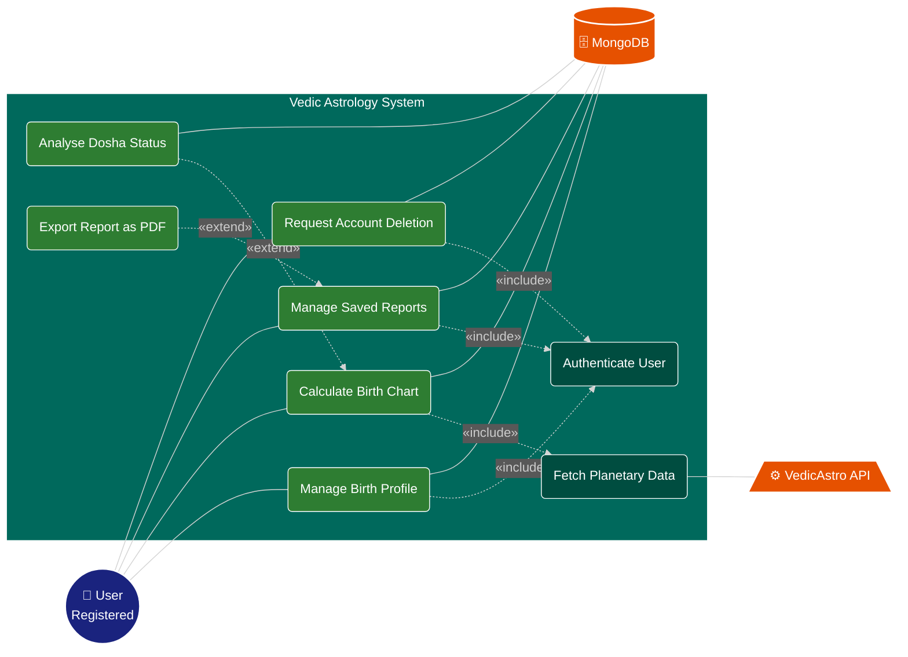

# Use Case Diagram

> System functionality overview for the Astrology backend

---

## Use Case Descriptions

### 1. Manage Birth Profile
- **Description**: Save DOB (Date of Birth), TOB (Time of Birth), and User Coordinates
- **Actor**: Registered User
- **Purpose**: Capture essential biographical data for astrological calculations
- **Preconditions**: User must be authenticated
- **Flow**: User enters birth data -> System validates -> Data stored in MongoDB

### 2. Calculate Birth Chart
- **Description**: Virtual Rendering via VedicAstro API
- **Actor**: Registered User
- **Purpose**: Generate comprehensive birth chart
- **External Systems**: VedicAstro API
- **Flow**: User triggers calculation -> System queries VedicAstro API -> Results stored

### 3. Analyse Dosha Status
- **Description**: Analyze Mangal Dosha, Kaal Sarp Dosha
- **Actor**: Registered User
- **Purpose**: Provide detailed dosha analysis
- **Dosha Types**: Mangal Dosha, Kaal Sarp Dosha

### 4. Manage Saved Reports
- **Description**: CRUD operations for Historical Charts
- **Actor**: Registered User
- **Purpose**: Store, retrieve, update, and manage historical calculations

### 5. Request Account Deletion
- **Description**: Soft-Delete with 30-Day Recovery Window
- **Actor**: Registered User
- **Purpose**: Safe account deletion with recovery option

---

## System Components

| Component | Purpose | Details |
|-----------|---------|---------|
| Registered User | Primary Actor | Interacts with all use cases |
| Birth Profile Management | Data Intake | Stores biographical information |
| Chart Calculation Engine | Processing | Integrates with VedicAstro API |
| Dosha Analysis Engine | Analysis | Mangal and Kaal Sarp analysis |
| Report Management | CRUD Operations | Historical data in MongoDB |
| Account Management | User Control | Soft-delete with 30-day window |
| VedicAstro API | External Service | Astronomical calculations |
| MongoDB | Database | Centralized data storage |

---

*Updated: April 2026*
