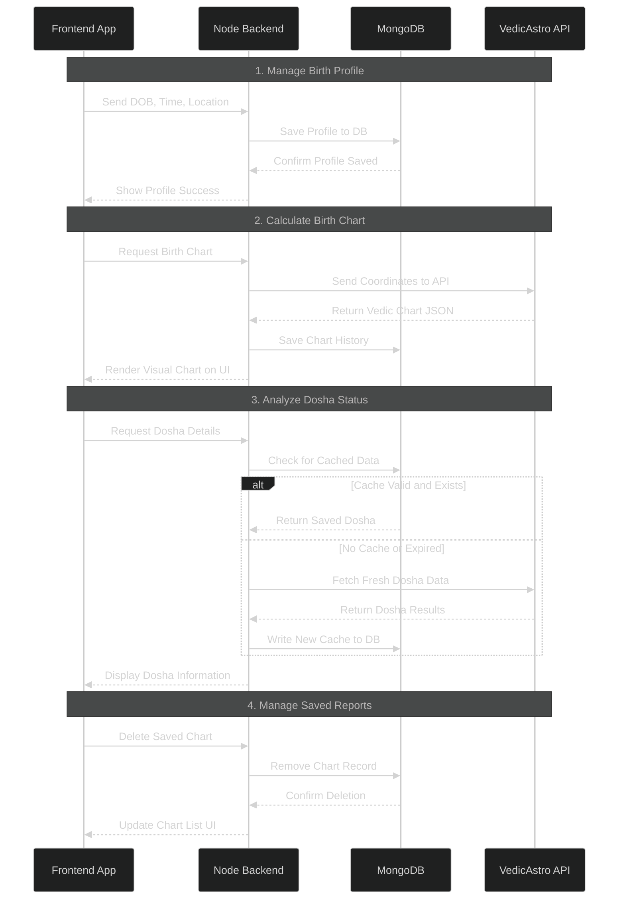

# Sequence Diagram

> Flow of operations for the Astrology backend

---

## Explanation

### Step 1: Manage Birth Profile
1. User sends Date of Birth, Time of Birth, and Location
2. Backend saves profile to MongoDB
3. Confirmation returned to user

### Step 2: Calculate Birth Chart
1. User requests birth chart generation
2. Backend calls VedicAstro API with coordinates
3. API returns chart data
4. Backend stores chart in MongoDB
5. Frontend displays the chart

### Step 3: Analyze Dosha Status
1. User requests dosha details
2. Backend checks for existing cached data in MongoDB
3. If cached - return saved data
4. If not cached - call VedicAstro API, store result, return to user

### Step 4: Manage Saved Reports
1. User requests to delete a chart
2. Backend removes record from MongoDB
3. Confirmation sent to frontend

---

*Updated: April 2026*
